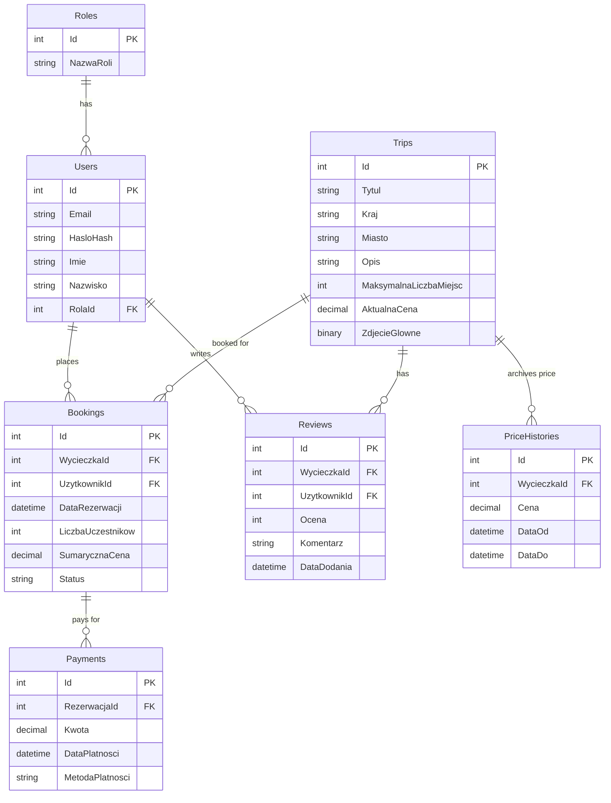

# 🌍 HorizonTravel - Trip Booking System ✈️

An client-server web application designed for travel agency offer management and trip booking. The system is built with a modern tech stack, runs entirely within dockerized containers, and utilizes advanced SQL Server database objects.

---

## 🎨 Design & UX
The application is designed with modern web aesthetics in mind:
* **Glassmorphism & Neon Aesthetics**: The user interface uses translucent panels with background blur effects, smooth gradients, and clean typography.
* **Full Responsiveness**: The application adjusts seamlessly to all screen sizes, from mobile phones to high-resolution desktop monitors.
* **Interactive SVG Charts**: Built natively without heavy external libraries. Includes an SVG line chart for monthly revenue and an SVG donut chart representing trip popularity based on total passenger counts. Both charts feature responsive hover effects and floating tooltips.

---

## 🚀 Technology Stack & Architecture

The application is structured into three main services running in separate Docker containers:

### 💻 Frontend (React + Vite)
* Modern React.js (Hooks, Context API)
* Super fast **Vite** bundler
* Pure **Vanilla CSS** for flexible, lightweight, and dependency-free styling
* **FontAwesome 6** icon library and **Outfit** font from Google Fonts

### ⚙️ Backend (ASP.NET Core Web API)
* **.NET 10.0** framework with C# 14
* Three-tier architecture utilizing the **Repository Pattern**
* **Entity Framework Core** with a Code-First database strategy
* Security: Token-based authentication using **JWT** and password hashing via **BCrypt**
* Global error handling middleware

### 🗄️ Database (MS SQL Server 2022)
* Relational database hosted in a Docker container
* Implemented native database objects (stored procedures, views, triggers, user-defined functions, and indexes) to optimize business logic operations

---

## 📦 Docker Containerization & Compose
The entire development environment is containerized and can be launched with a single command. The `docker-compose.yml` file manages three main services:
1. `db`: SQL Server 2022 (exposed on port `1433`)
2. `backend`: ASP.NET Core API (exposed on port `60247`)
3. `frontend`: React app (exposed on port `5173` with file polling enabled for Hot Module Replacement)

---

## 🗃️ Database Schema
The database consists of **7 tables** driving the business, historical, and rating logic:



---

## 🛠️ Stored SQL Database Objects
To satisfy academic and database optimization requirements, the database implements the following mechanisms:

1. **Non-Clustered Index**:
   * Placed on `Trips(Kraj, AktualnaCena)` to speed up trip catalog searches and price sorting.
2. **Database View `v_TripPopularityAndRevenue`**:
   * Joins trips, bookings, and payments. Returns popularity statistics (transaction count and total traveler count) and total revenue generated for each trip.
3. **Stored Procedure `sp_GetMonthlySalesReport(Rok)`**:
   * Returns a breakdown of revenues across the 12 months of a given year, grouping payments by **trip start date** (`DataRozpoczecia`). This distributes revenues naturally based on when the travel takes place.
4. **Database Trigger `tr_ArchivePriceOnUpdate`**:
   * Fires on updates to the `Trips` table. Whenever `AktualnaCena` (current price) changes, the trigger archives the previous price into `PriceHistories` along with its validity time range (from-to).
5. **User-Defined Function (UDF) `fn_CalculateLoyaltyDiscount(UzytkownikId)`**:
   * Analyzes a client's travel history. Returns a loyalty discount on new bookings: **5% off** for 2+ paid trips, and **10% off** for 5+ paid trips.

---

## 🔑 Key Features

### 👤 Client Area
* **Registration & Login** with automatic loyalty discount calculations.
* **Trip Browser** with dynamic search filtering by country and sorting by price (ascending/descending).
* **Automatic Scenic Images**: If no custom image is uploaded to the database for a trip, the frontend automatically serves beautiful, context-relevant landscape photos from Unsplash based on the destination's city/country names.
* **Overbooking Protection**: The system prevents bookings that exceed the trip's available capacity.
* **Payment Module**: Secure, simulated payment flow (Credit Card, PayPal, Bank Transfer) that updates booking status to `Opłacona` (Paid).
* **My Bookings View**: A client dashboard showing booked trips with direct payment links for pending items and a "Details" button (which opens details with the booking form hidden and the payment status badge visible).
* **Reviews & Ratings**: Logged-in users can write text reviews and rate trips (1-5 stars).

### 👑 Admin Dashboard
* **Offer Management (CRUD)**: Create new trips, edit existing ones (which triggers price archiving), and delete trips.
* **Image Upload**: Upload custom JPG/PNG photos from a local computer directly to the database.
* **Financial Analytics Panel**:
  * Real-time metrics for total bookings, total revenue, and active trip count.
  * Popular trips table (booking count and total travelers).
  * Monthly sales table.
  * **Interactive Visualizations**: Modal dialog containing the monthly revenue line chart and trip popularity donut chart (calculated by total passengers).
  * Manual statistics refresh button without reloading the page.

---

## 🛠️ Setup & Installation

### Requirements:
* Installed [Docker Desktop](https://www.docker.com/products/docker-desktop/)

### Launch Instructions:

1. Clone or download the repository files.
2. Open a terminal in the root folder of the project (where `docker-compose.yml` is located).
3. Run the following command to build and launch the containers:
   ```bash
   docker compose up --build
   ```
4. Once the services start up, access the application via:
   * **Frontend Website**: [http://localhost:5173](http://localhost:5173)
   * **Backend Swagger API**: [http://localhost:60247/swagger](http://localhost:60247/swagger)
   * **MSSQL Database**: Port `1433`, username `sa`, password defined in `.env` (default is `YourStrong(!)Password2026`).

---

## 👥 Seed Accounts (Test Credentials)
The database is pre-seeded with test data upon initialization. You can log in using the following credentials:

| Role | Email Address | Password | Description |
| :--- | :--- | :--- | :--- |
| **Administrator** | `admin@travel.com` | `Admin123!` | Full administrative access, CRUD permissions, and sales stats. |
| **Client** | `client@travel.com` | `Client123!` | Customer account seeded with 5 paid bookings (pre-entitled to a 10% loyalty discount). |

You can also create a new client account using the built-in registration form!
